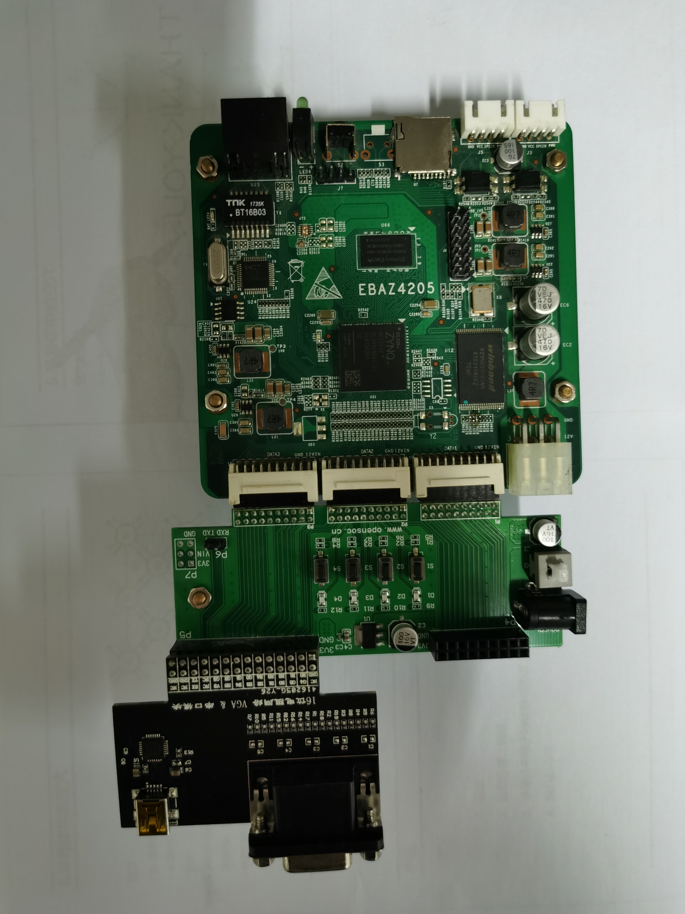

# Freedom SoC

I port Freedom E300 platform for Zybo Kit Board and Ebaz4205 Board.

This repository has been moved to my another Repository: https://github.com/gongqingfeng/freedom

Note: if you can't access github website in China, you can access my repository from gitee: https://gitee.com/gongqingfeng/freedom

Freedom repository has many branches. The default branch is freedom_zybo. 

The branch freedom_zybo is for Zybo Kit Board and the branch ebaz4205 is for Ebaz4205 Board.
ebaz4205 board picture:

